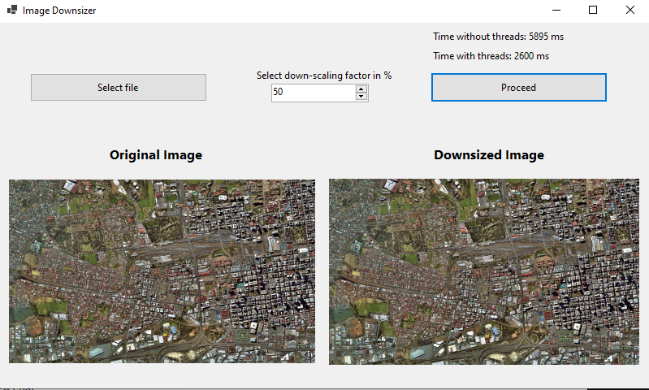

# ImageDosnsizer

This is a WinForms application which down-sizes images. 
The app lets users select an image using the standard open file dialog, enter a downscaling factor (real number), and produce a new down-scaled image.  
It implements a downscaling algorithm in two ways: consequential and parallel, measures the performance with different image sizes, and reports the results.

## Details

The downscaling factor is a percentage of the original size.  The image aspect ratio must preserved. For example, if the original image size is 1000 x 500, a down-scaling factor of 50% will produce an image of size 500x250, a down-scaling factor of 10% will produce an image of size 100x50, and if the factor is 80%, the new image size will be 800 x 400.

## Testing

In this image you can see the measured AVERAGE time for downscaling when the factor is 50%. 

The testing is made with: 

## Results

As expected, the parallel method with threads performs better
The AVERAGE TIME for downscaling is: 5895ms
The AVERAGE TIME for donwscaling with THREADS is: 2600ms
